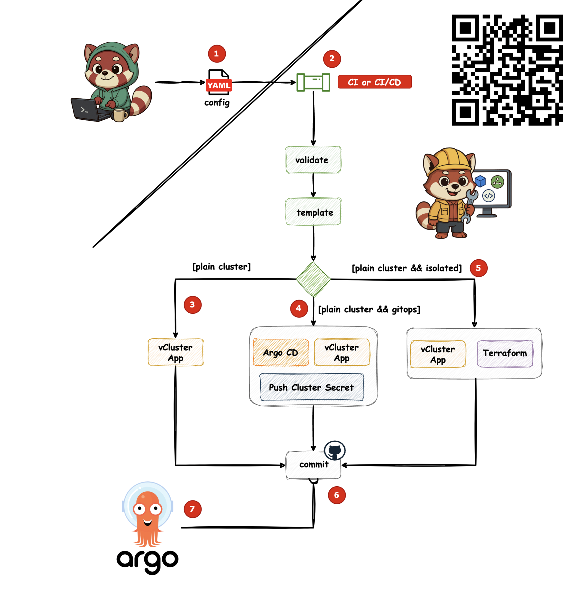
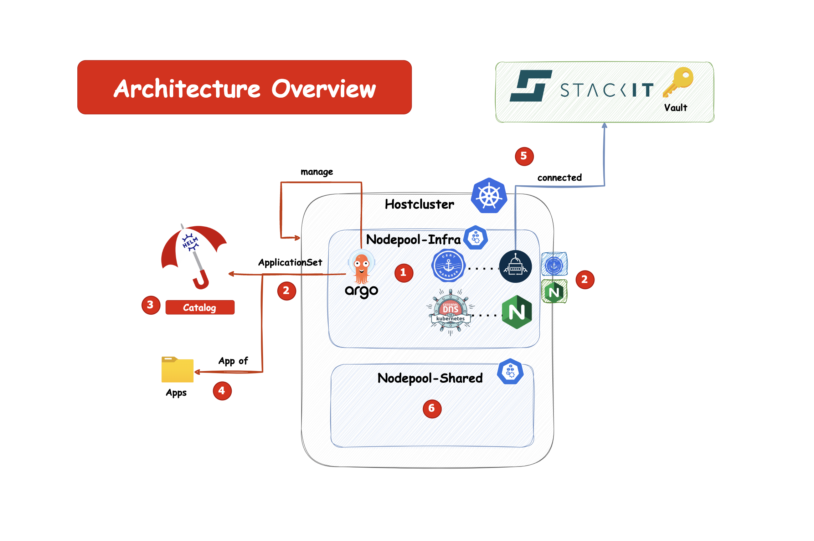
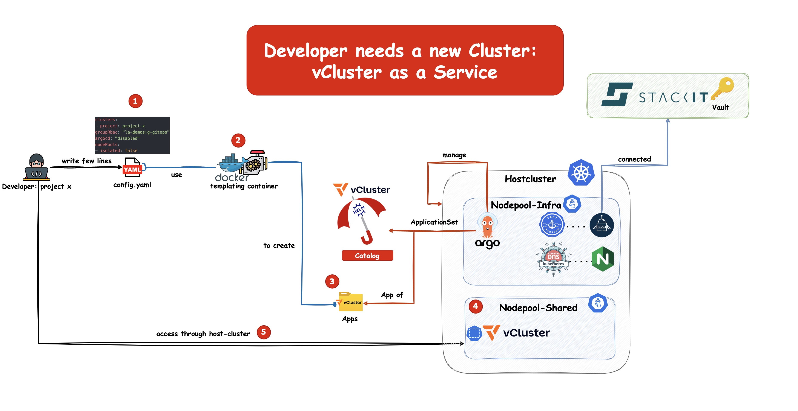
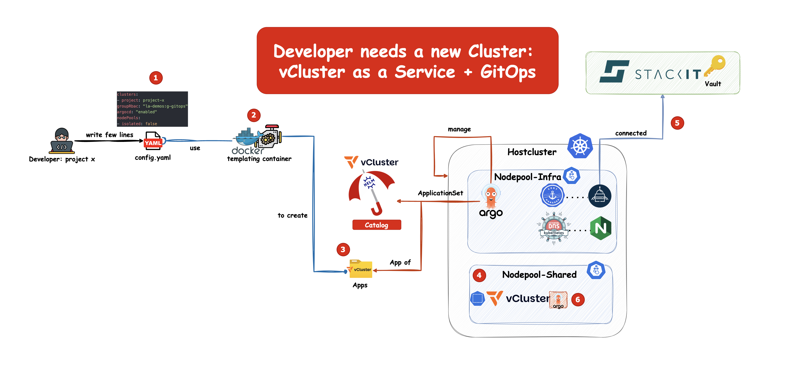
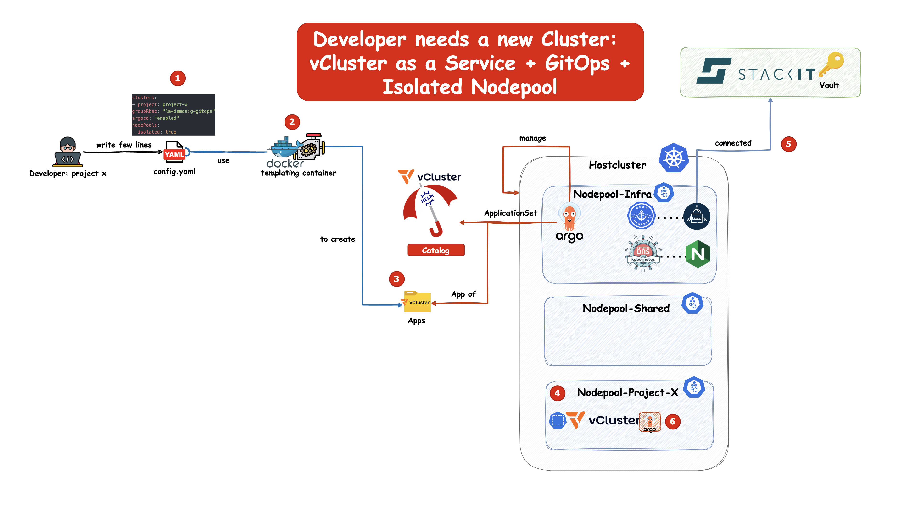
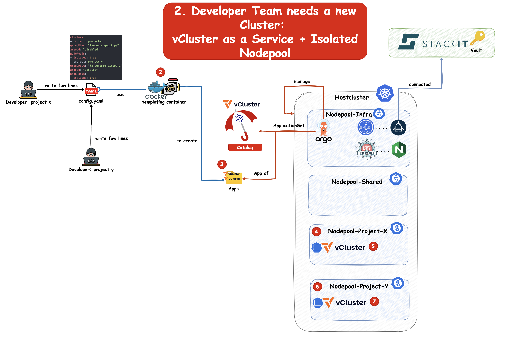
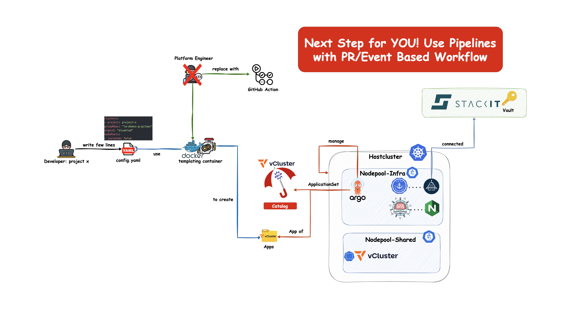
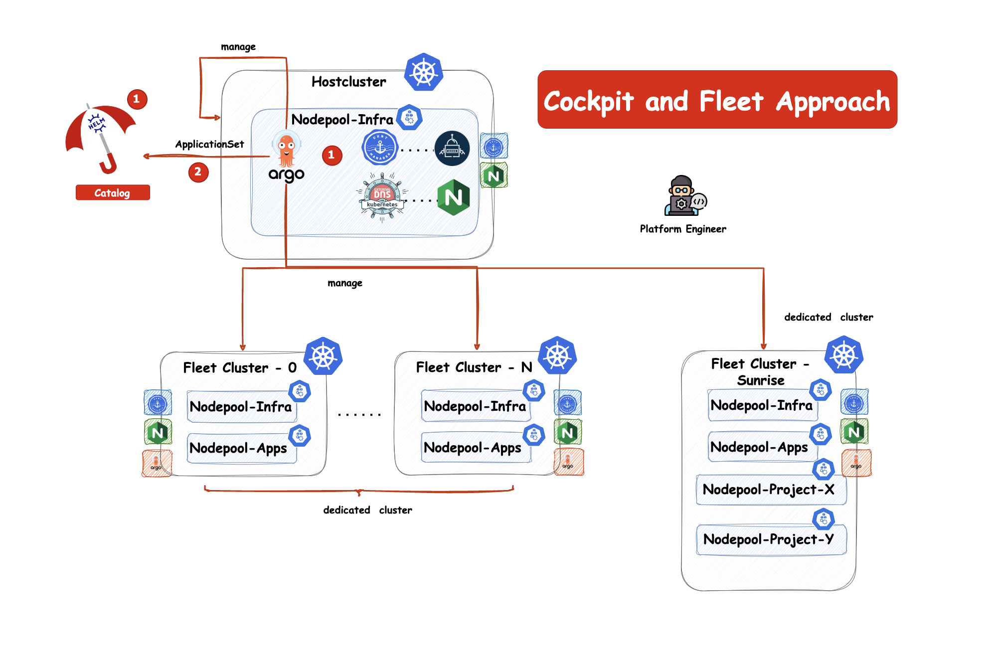
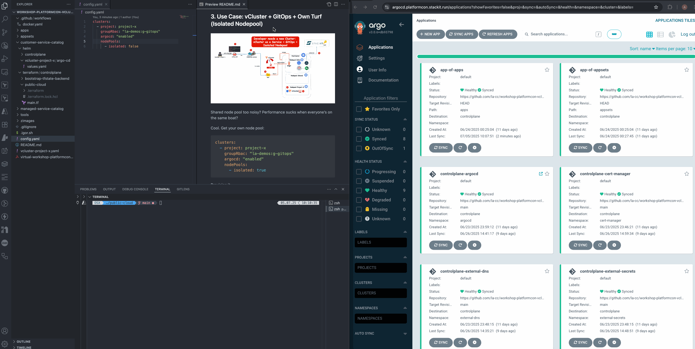
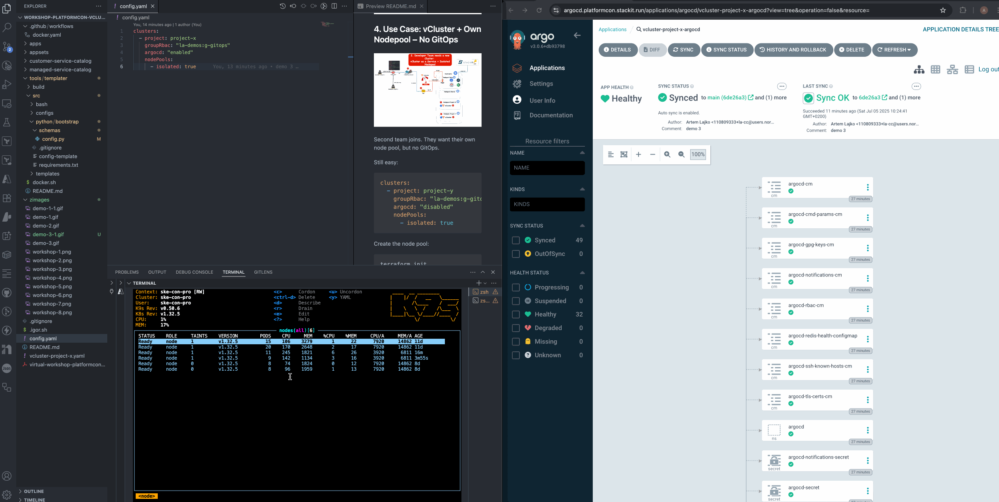

# Guest Lecture: Platform Engineering Org 2025 – How to Build a Multitenancy Internal Developer Platform (WIP)

> ***Heads up:*** Build it locally if you want:
> `docker build . -f tools/templater/build/docker/Dockerfile -t workshop-templater:0.0.0`


## 🔧 Tooling: Igor

To simplify templating workflows, we use [`igor`](https://github.com/la-cc/igor) — a lightweight shell wrapper to run your Docker-based tooling with ease.

### Install Igor:

```bash
sudo curl https://raw.githubusercontent.com/la-cc/igor/main/igor.sh -o /usr/local/bin/igor
sudo chmod +x /usr/local/bin/igor
```


---

## Workflow Overview




---

## Architecture? Just a Quick Look



Yeah, that’s how things are wired.

---

## 1. Use Case: vCluster – The Fast Lane to K8s



Dev team just needs a place to deploy stuff. No frills, no drama.
They want a Kubernetes playground. Here’s how little it takes:

```yaml
clusters:
  - project: project-x
    groupRbac: "la-demos:g-gitops"
    argocd: "disabled"
    nodePools:
      - isolated: false
```

That’s it. Now spin it up:

```bash
igor ....
config-template --all
```

Need to jump into the cluster?

```bash
vcluster connect vcluster-project-x -n vcluster-project-x --server=vcluster-project-x.pe-org-lecture.stackit.run --print --kube-config-context-name vcluster-project-x > vcluster-project-x.yaml

kubectl --kubeconfig vcluster-project-x.yaml get ns
```

You're in. Done.

---

## 2. Use Case: vCluster + GitOps = 🚀



Now the devs want GitOps.
Why? Because they’re tired of clicking and guessing.

Update the config:

```yaml
clusters:
  - project: project-x
    groupRbac: "la-demos:g-gitops"
    argocd: "enabled"
    nodePools:
      - isolated: false
```

Use `k9s`, cruise around:

```bash
k9s --kubeconfig vcluster-project-x.yaml
```

Wanna go full SSO? Sure. But **don’t** leave the Argo admin account wide open.
Either:

* Disable admin
* Add limited users
* Or better: Dex + your OIDC provider

SSO the right way. No shortcuts.

---

## 3. Use Case: vCluster + GitOps + Own Turf (Isolated Nodepool)



Shared node pool too noisy? Performance sucks when everyone’s on the same boat?

Cool. Get your own node pool:

```yaml
clusters:
  - project: project-x
    groupRbac: "la-demos:g-gitops"
    argocd: "enabled"
    nodePools:
      - isolated: true
```

Provision it:

```bash
terraform init
terraform plan
terraform apply --auto-approve
```

Double-check:

```bash
kubectl get nodepool
```

Now check your app setup and `values.yaml`.
Push. Argo takes over. That's the GitOps promise.

---

## 4. Use Case: vCluster + Own Nodepool – No GitOps



Second team joins. They want their own node pool, but no GitOps.

Still easy:

```yaml
clusters:
  - project: project-y
    groupRbac: "la-demos:g-gitops-2"
    argocd: "disabled"
    nodePools:
      - isolated: true
```

Create the node pool:

```bash
terraform init
terraform plan
terraform apply --auto-approve
```

Deploy. Test. All yours:

```bash
vcluster connect vcluster-project-y -n vcluster-project-y --server=vcluster-project-y.pe-org-lecture.stackit.run --print --kube-config-context-name vcluster-project-y > vcluster-project-y.yaml

kubectl --kubeconfig vcluster-project-y.yaml get ns
```

---

## Cleanup? Just Delete It

We like onboarding. But offboarding?
Nobody wants to clean up — unless it’s this easy.

Remove the config:

```yaml
clusters:
  - project: project-x
    groupRbac: "la-demos:g-gitops"
    argocd: "enabled"
    nodePools:
      - isolated: true
```

Then run Terraform:

```bash
terraform init
terraform plan
terraform apply --auto-approve
```

Commit, push — Argo wipes the slate clean.

---

## Want to Go Bigger?



* vSphere + Tanzu + LDAP
* Dex + OIDC + `kubelogin`
* Argo CD with Dex setup
* Automate it all: pipeline, pull requests, events — your call

---

## Zoomed-Out View: The Big Picture



Everything sits on top:
Your cockpit, your sunrise, your vClusters, your other clusters.
Same model. Zero extra effort.

---

## What You’ll Learn (or Already Did)

* How to build a real internal platform catalog
* What “self-service” means (hint: not a pretty UI)
* GitOps: love it or hate it, it's powerful
* Developer pain is real — make it go away
* App of Apps pattern, explained by doing
* ApplicationSets + cluster generators + label-based deploys
* Templating that actually scales
* Secrets management with External Secrets Operator = modern ops
* vCluster = ephemeral clusters in minutes
* Multi-tenancy done right
* Save serious \$\$\$ by doing this smart

---

## Demos:

You can see the demos from up in action below.

### 1: just a vCluster

Create a vCluster in a shared node pool, no GitOps, no frills.


Connect to it, check namespaces.


### 2: vCluster + GitOps

Create a vCluster with GitOps enabled, using Argo CD and ApplicationSets.


### 3: vCluster + GitOps + Isolated Nodepool

Create a vCluster with GitOps and an isolated node pool.

Bootstrap the node pool with Terraform.



Commit and push, so Argo CD can redeploy vCluster and Argo CD to the new node pool.


Check the new node pool, see the vCluster running there.



### 4: New Project Y: vCluster

Create a new project with a vCluster, GitOps disabled, and an isolated node pool disabled (diff from the demo description above).


### 5: Cleanup Project Y

Cleanup the project Y by removing few lines.


---

**BE A REAL PLATFORM ENGINEER.**
Not a ticket-pusher. Not a YAML monkey.
Build tools, not toil.


## Kubara Updates Incoming

In this small example you can see just a fraction which is generated by kubara. A Framework and Go Binary that will help you to build your own Internal Developer Platform.

Status now: Inner-Source