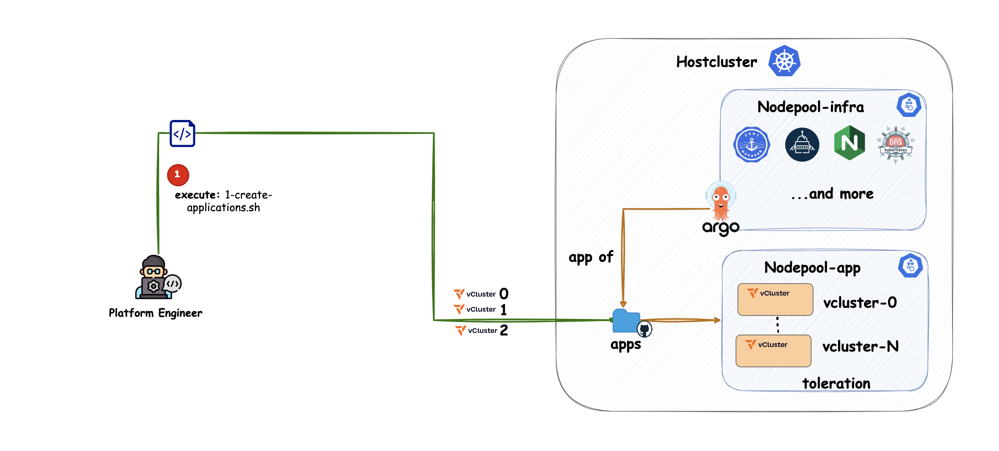
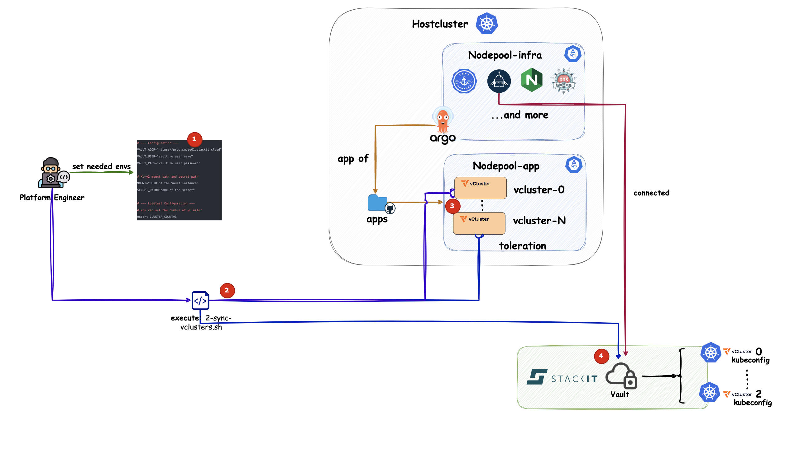
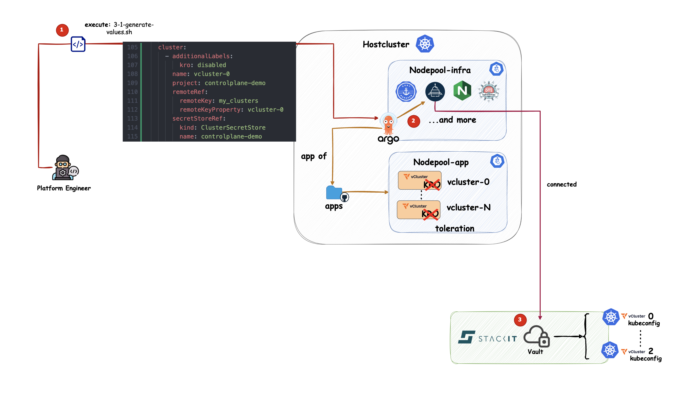
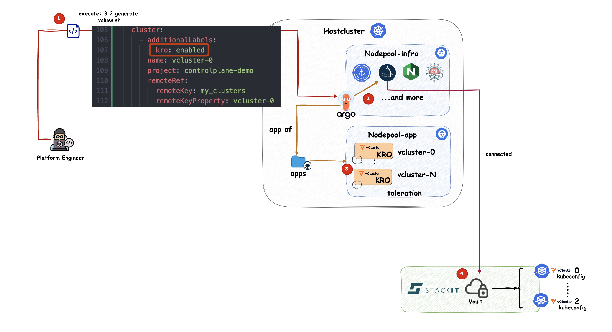
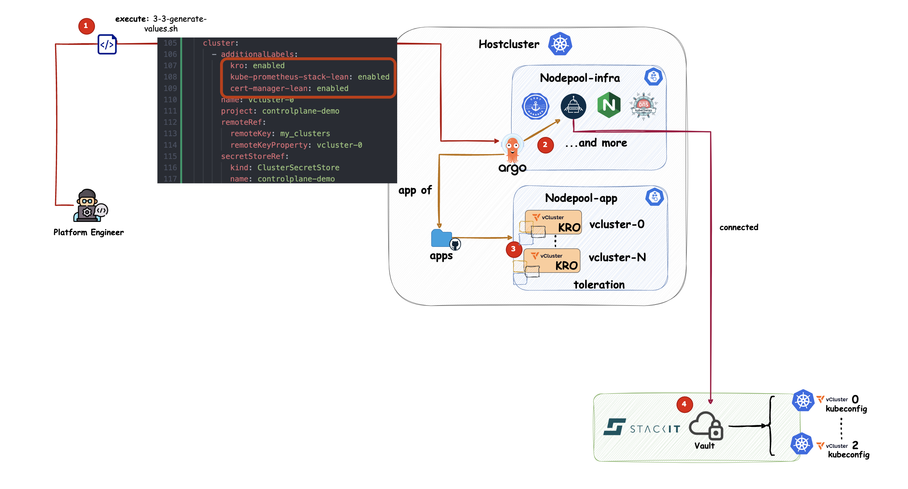

# vCluster Webinar 2025 – Argo CD Scale Test

First, set the number of vClusters you want to create:

```bash
export CLUSTER_COUNT=5
```

---

## 1. Create vClusters and Argo CD Applications



We create the vClusters with the script `1-create-applications.sh`.
`CLUSTER_COUNT` controls how many vClusters are created.
The Applications are generated into the `apps/` folder.

```bash
./1-create-applications.sh
```

Check:

* k9s

---

## 2. Sync vClusters to Vault



Now we fetch the kubeconfigs of all vClusters and push them into Vault.
The script `2-sync-vclusters.sh` creates the secrets in Vault.

```bash
./2-sync-vclusters.sh
```

Check:

* STACKIT Portal - Vault
---

## 3. Add vClusters to Argo CD



Next we connect the vClusters to Argo CD.
The script `3-1-generate-values.sh` creates a `values.yaml` with all cluster information.
This is our first test case: how many clusters can one Argo CD handle?

```bash
./3-1-generate-values.sh > customer-service-catalog/helm/controlplane/argo-cd/values.yaml
```

Check:

- k9s and in the Argo CD UI.
- Clusters are listed in Argo CD

---

## 4. Add Kro as Application



Now we deploy Kro to each vCluster.
Argo CD uses ApplicationSets and labels to send the apps to the vClusters.

```bash
./3-2-generate-values.sh > customer-service-catalog/helm/controlplane/argo-cd/values.yaml
```

Check:

* k9s
* clusters and labels in Argo CD UI
* Kro running on the correct nodepool

---

## 5. Add Kro, cert-manager and Prometheus



Finally, we increase complexity.
We deploy three applications (Kro, cert-manager, Prometheus) to each vCluster.
This gives more objects and shows how well Argo CD scales.

```bash
./3-3-generate-values.sh > customer-service-catalog/helm/controlplane/argo-cd/values.yaml
```

Check:

* k9s
* clusters and labels in Argo CD UI
* Kro, Cert-Manager, Prometheus running on the correct nodepool